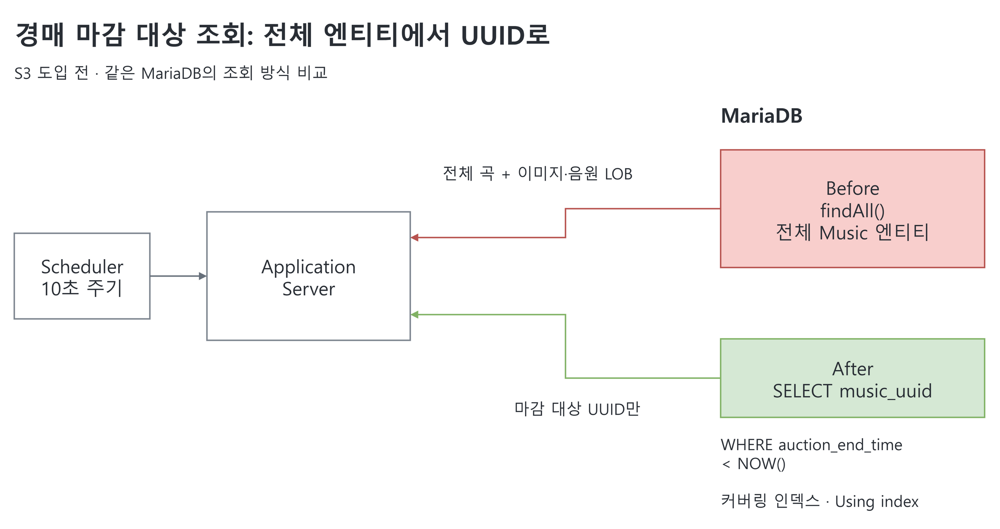
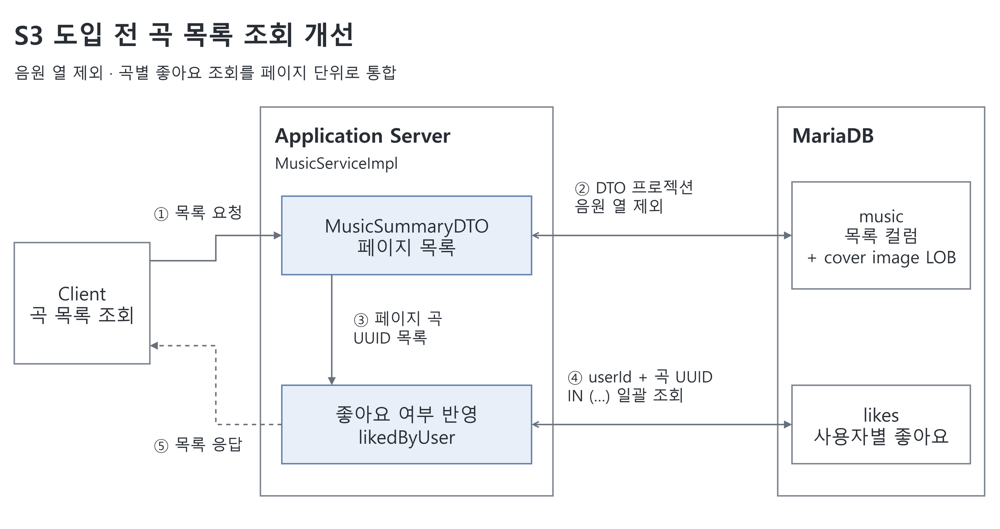
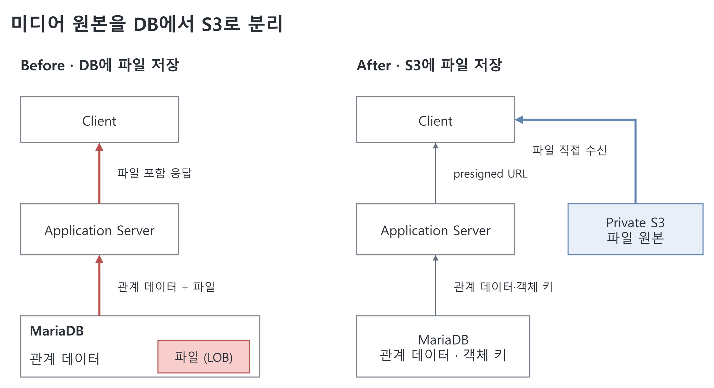
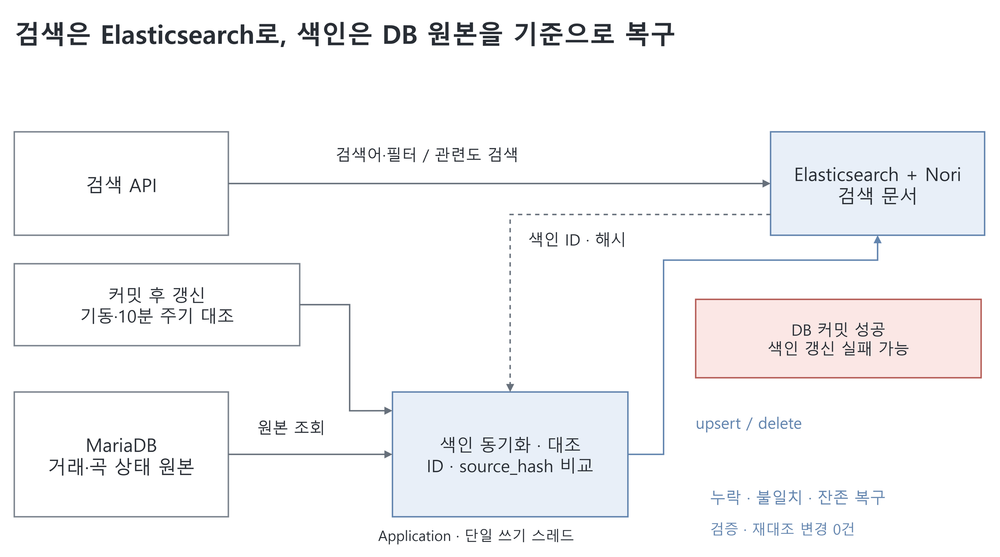

# NoteNest

음원을 등록하고 입찰·낙찰·결제를 거쳐 거래하는 경매 서비스입니다.

| 구분 | 내용 |
|---|---|
| 팀 프로젝트 | 2024년 음원 경매 서비스 개발 |
| 담당 기능 | 경매 마감·낙찰, 결제 기한·차순위 승계, 이메일, 입찰·낙찰 내역, 사용자별 다운로드·횟수 관리 |
| 미디어 연동 | 이미지·음원 multipart 등록 및 수정 업로드 보완 |
| 개인 리팩터링 | 2026년 7~9월 경매 배치와 목록 조회 최적화, S3 이전, 금액 처리 수정, 검색 추가 |

## 기술 스택

| 영역 | 기술 |
|---|---|
| Backend | Java 17 소스 호환, Spring Boot 3.2.5, Spring Security, JWT |
| Data | Spring Data JPA, QueryDSL, MariaDB 10.11 |
| 검색 | Elasticsearch 8.11.1, Nori |
| 객체 저장 | private AWS S3, AWS SDK for Java v2 |
| 결제·메일 | Iamport REST Client, Spring Mail, Thymeleaf |
| 로컬 환경 | Docker Compose, smtp4dev |
| 검증 | JUnit 5, MockMvc, H2, Testcontainers, k6, 검색 qrels, Hibernate SQL 로그, EXPLAIN |

## 주요 기능

- **곡:** S3 이미지·음원 등록, 한국어 검색·BPM·키 필터·정렬, 좋아요
- **경매:** 입찰, 마감·낙찰 처리, 결제 기한 관리, 차순위 승계
- **거래 내역:** 입찰·낙찰 내역, 로그인 사용자별 다운로드·횟수 관리
- **회원·알림:** JWT 인증, 경매 진행에 따른 이메일 알림

## 주요 개선 사항

팀 프로젝트 종료 후 개인적으로 개선한 내용입니다. 배치·목록 조회 최적화를 먼저 진행하고, 이후 이미지·음원을 S3로 옮겼습니다.

- 측정 환경: 로컬 Windows 11, Docker MariaDB 10.11
- 미디어 테스트 데이터: 곡당 음원 3MB·커버 이미지 300KB

### 1. 경매 마감 대상만 조회하도록 배치 수정



**문제**

- 10초 주기 스케줄러에서 `findAll()`로 모든 곡을 읽고 Java에서 마감 여부 판정
- 곡 엔티티에 포함된 이미지·음원 LOB까지 로딩
- 500곡 테스트에서 메모리 부족으로 배치 중단(OOM)

**개선**

- DB에서 마감 시각으로 필터링하고 대상 곡의 UUID만 조회
- `auction_end_time` 인덱스 추가
- EXPLAIN의 `Using index`로 대상 UUID 조회의 커버링 인덱스 사용 확인
- 같은 테스트 데이터로 변경 전후 낙찰 결과가 같은지 확인

**검증 결과**

| 지표 | 개선 전 | 개선 후 |
|---|---:|---:|
| 100곡 기준 대상 식별 시간 | 5~8초 | 0.07초 |
| 대상 식별 시 힙 증가 | 1.3~2.2GB | 약 4MB |
| 500곡 배치 실행 | OOM으로 중단 | 완료 |
| 낙찰 결과 분포 | 기준 분포 | 동일 |

- 조건: S3 도입 전, Java 17, 최대 힙 3.9GB, 전체 곡의 절반을 종료 대상으로 구성
- 시간은 전체 배치가 아닌 마감 대상 조회 구간에서 측정

**후속 개선: 마감 작업과 결제 후속 작업 분리**

- 마감 대상: `status=0`이면서 마감 시각이 지난 곡
- 결제 후속 대상: `PENDING` 입찰이 있는 곡
- 마감 처리 후 다음 사이클의 마감 대상에서 제외
- 차순위 승계: 동일 사용자의 하위 입찰을 건너뛰고 다른 사용자에게 승계, 최대 2명 유지
- Clock을 고정한 반복 실행 테스트로 중복 상태 변경·메일 발송이 없는지 확인

| 지표 | 분리 전 | 분리 후 |
|---|---:|---:|
| 최초 마감 후 반복 마감 대상 | 250건 | 0건 |
| 낙찰 상태·이메일 플래그 | 기준 결과 | 동일 |

- 별도 측정 조건: Java 21.0.12, 최대 힙 약 8GB, 500곡 중 절반 종료, 웜 5회

[배치 구현](src/main/java/com/notenest/service/BidServiceImpl.java) · [인덱스 추가 SQL](scripts/migration/phase1-01-add-auction-end-time-index.sql) · [1차 측정 기록](docs/measurements/phase1-after-step1.md) · [대상 분리 측정 기록](docs/measurements/n2-target-separation-before-after.md)

### 2. 목록 조회의 음원 로딩과 좋아요 N+1 제거



**문제**

- 최신순 조회는 DTO를 사용했지만, `maxPrice` 필터는 `Specification + findAll`로 엔티티 조회
- 가격 필터를 쓰면 목록에 필요 없는 음원 LOB까지 다시 로딩
- 곡마다 로그인 사용자의 좋아요 여부를 추가 조회하는 N+1 발생

**개선**

- 목록 전용 DTO로 커버 이미지는 유지하고 음원 열은 SELECT·응답에서 제외
- 공개 경매 목록의 검색·필터·정렬 분기를 QueryDSL DTO 프로젝션으로 통일
- 페이지 곡 UUID를 모아 좋아요 여부를 `IN` 쿼리 1회로 조회
- 테스트 17개로 응답·정렬·검색·필터 동작과 SQL의 음원 열 제외 확인

**검증 결과**

| 지표 | 개선 전 | 개선 후 |
|---|---:|---:|
| 응답시간 p90 | 2.65초 | 0.17초 |
| 요청당 응답 수신량 | 약 46MB | 약 4.1MB |
| 요청당 전체 SQL | 14회 | 4회 |
| 좋아요 여부 조회 | 곡마다 1회 | 페이지 전체 1회 |
| 목록 SELECT의 음원 열 | 포함 | 제외 |
| 커버 이미지 | 포함 | 동일 바이트 유지 |

- 조건: S3 도입 전, Java 21.0.12, 인증된 `maxPrice` 필터 요청, 페이지 10곡
- 시드·부하: 곡 100건 중 진행 중 50건, k6 10 VU × 30초 웜 2회차
- 비교 방식: 같은 머신에서 개선 전후 연속 측정, 전체 SQL은 요청 스레드 기준 집계

[DTO 프로젝션](src/main/java/com/notenest/repository/MusicRepositoryCustomImpl.java) · [좋아요 IN 조회](src/main/java/com/notenest/repository/LikeRepository.java) · [측정 기록](docs/measurements/n1-filter-maxprice-before-after.md)

### 3. 이미지·음원을 DB에서 S3로 이전



**문제**

- 조회 쿼리를 줄인 뒤에도 결제 후속 배치가 곡 엔티티를 읽을 때 LOB를 함께 로딩
- 목록 응답에도 base64 커버 이미지가 남아 전송량 증가

**개선**

- DB에는 관계 데이터·객체 키를 저장하고, 이미지·음원은 private S3로 분리
- 목록은 커버 URL, 로그인 상세는 미리듣기 URL 제공
- 전체 데모는 판매자·결제 완료 낙찰자 확인 후 5분 presigned URL 발급
- 파일 업로드 도중이나 업로드 후 DB 저장에 실패하면 업로드한 객체 삭제 시도
- 테스트 파일을 S3로 이전하고 누락·크기·SHA-256을 확인한 뒤 DB의 LOB 제거

**검증 결과**

| 지표 | S3 전 | S3 후 |
|---|---:|---:|
| 500곡 결제 후속 처리, 5회 평균 | 24.95초 | 1.28초 |
| 같은 처리 구간의 힙 사용량 | 1.6~2.7GB | 49~211MB |
| 100곡·페이지 10건 목록 응답 | 4.1MB | 5.9KB |
| 목록 요청당 SQL | 4회 | 4회 |
| 백필 재실행 신규 업로드 / 최종 불일치 | 해당 없음 | 0건 / 0건 |

- 조건: Java 17, 로컬 MariaDB 10.11·실제 S3 서울 리전, 더미 음원·커버
- 배치 처리 대상 167건·SQL 502개는 동일. 파일을 DB에서 읽지 않도록 바꿔 처리 시간과 메모리 사용량 감소

[저장 구현](src/main/java/com/notenest/storage/S3ObjectStorage.java) · [실제 S3 검증](docs/verification/nb1-real-s3-e2e.md) · [백필 검증](docs/verification/nb1-backfill.md) · [재측정](docs/measurements/nb1-after-s3.md)

### 4. 입찰·결제 금액을 원 단위 정수로 통일

**문제·개선**

- 실수형 금액, 결제 배율, 정수 변환을 섞어 사용해 소수 금액 절삭과 오버플로우 발생
- 금액은 원 단위 정수로 통일하고 소수 입력은 오류로 처리

| 처리 위치 | 변경 내용 |
|---|---|
| API 입력 | 소수 JSON은 400, 시작가·입찰가·결제는 1원~100억원 |
| PG 검증 | `BigDecimal.longValueExact()`로 변환 후 입찰가와 원 단위 직접 비교 |
| 도메인·DB | `long/BIGINT` 통일 |
| 데이터 전환 | 비정상 행 탐지 시 중단, 백업·전환 후 행 수·PK·금액 대조 |

**검증 결과**

- 30억원을 변환·저장해도 값이 유지되고, 소수·범위 초과 금액은 거부
- 입찰가와 결제 금액이 다르거나 PG 조회에 실패하면 성공 결제로 저장하지 않음
- 테스트 데이터의 타입 변경·백업 복구 후 금액 불일치 0건
- 조건: Java 17, MariaDB 10.11·H2, 실제 PG 대신 테스트 대역·테스트 데이터 사용

[PG 금액 검증 테스트](src/test/java/com/notenest/payment/PaymentServiceAmountTest.java) · [입찰·결제 흐름 검증](src/test/java/com/notenest/payment/PaymentAmountFlowIntegrationTest.java)

### 5. 한국어 검색 개선과 검색 색인 복구



**문제**

- `%keyword%` OR·최신순 검색에서 제목이 정확히 일치하는 곡도 뒤로 밀림
- 조사·띄어쓰기·단어 순서가 달라지면 원하는 곡을 찾지 못하는 사례 확인
- Elasticsearch를 추가하면서 DB에 저장한 내용이 검색 색인에 반영되지 않는 경우도 처리

**대안 비교**

| 후보 | 전체 nDCG@5 | 곡명 MRR@5 |
|---|---:|---:|
| 기존 LIKE | 0.5084 | 0.3889 |
| LIKE + 질의 규칙 | 0.8359 | 1.0000 |
| MariaDB FULLTEXT | 0.8472 | 0.9444 |
| Elasticsearch + Nori | 0.8860 | 1.0000 |

- 조건: 현장 자문을 참고해 만든 검색어 25개·곡 57개. 구현 전에 정답과 관련도(qrels v1)를 고정
- 정확 일치 우선 등 질의 규칙만으로 0.51→0.84 개선
- Nori 적용 후 0.89 기록. 조사·띄어쓰기·단어 순서가 다른 검색에서 추가 개선을 확인해 채택

**개선**

- 검색어가 있으면 Elasticsearch, 없으면 기존 QueryDSL 목록 경로 사용
- 정확 제목·판매자 우선 규칙과 Nori 분석 결합, BPM 범위·키 필터 추가
- 기본 정렬은 `_score → created_at → music_id`. 기존 정렬 옵션·페이지·좋아요·커버 URL 유지
- 커밋 후 단일 쓰기 스레드에서 색인 갱신, 최대 3회 시도 후 미확인 기록
- 기동 시와 10분마다 DB·색인의 ID와 `source_hash` 비교. 누락·불일치는 갱신하고 DB에 없는 문서는 삭제

**검증 결과**

| 항목 | 결과 |
|---|---|
| 누락·내용 불일치·삭제 잔존·색인 전체 유실 | 원본 기준 복구, 재대조 변경 0건 |
| ES 쓰기 차단 중 곡 등록 | 201·DB 저장 유지, 후속 대조로 복구 |
| ES 검색 장애 | 검색어 요청 503, 무검색 목록 200 |
| 10,000곡 검색 p90 | LIKE 42.68ms → ES 12.93ms |
| 추가 자원 | ES 컨테이너 최고 1,273.9MiB / 상한 1.5GiB |

- 성능 조건: Java 17, 로컬 MariaDB 10.11·ES 8.11.1+Nori, 25질의·10 VU×30초, 웜 3회 평균
- 직접 만든 평가셋의 결과이며 실제 사용자 검색 로그를 측정한 수치는 아님

[기술 선택](docs/nb5/adr-001-search-engine.md) · [동기화·복구](docs/nb5/phase4-index-sync.md) · [최종 검증](docs/nb5/phase5-final-verification.md)

## 검증 코드

| 검증 항목 | 테스트·스크립트 |
|---|---|
| 목록 응답·커버 URL·필터·정렬·좋아요·검색 호출 | [MusicFilterContractTest](src/test/java/com/notenest/contract/MusicFilterContractTest.java) |
| 경매 마감·결제 기한·차순위 승계 | [AuctionLifecycleScenariosTest](src/test/java/com/notenest/batch/AuctionLifecycleScenariosTest.java) |
| 동일 사용자의 중복 입찰 처리 | [AuctionEndSameBidderPromotionTest](src/test/java/com/notenest/batch/AuctionEndSameBidderPromotionTest.java) |
| 반복 실행 시 중복 상태 변경·메일 발송 방지 | [AuctionBatchIdempotencyTest](src/test/java/com/notenest/batch/AuctionBatchIdempotencyTest.java) |
| 인증된 가격 필터 목록 부하 | [list-api-perf-maxprice.js](scripts/k6/list-api-perf-maxprice.js) |

- 2026-09-26 기준 기본 테스트 222개·실제 ES 통합 테스트 17개 통과
- 미디어 접근 권한·업로드 실패 처리: [MediaAccessContractTest](src/test/java/com/notenest/contract/MediaAccessContractTest.java), [MusicStorageFlowTest](src/test/java/com/notenest/contract/MusicStorageFlowTest.java)
- 검색·복구: [MusicSearchQualityIT](src/test/java/com/notenest/search/it/MusicSearchQualityIT.java), [MusicSearchSyncIT](src/test/java/com/notenest/search/it/MusicSearchSyncIT.java)

## 로컬 실행

- 준비: JDK 21, Docker Compose
- 빌드 설정: Java 17 소스 호환
- 설정 확인: [기본 설정](src/main/resources/application.properties), [local 설정](src/main/resources/application-local.properties)
- [Compose 구성](docker-compose.yml): MariaDB `localhost:3311`, Elasticsearch+Nori `localhost:9201`, SMTP `localhost:2525`
- 로컬 메일 확인: smtp4dev 웹 UI `localhost:5001`

```powershell
docker compose up -d --build
.\gradlew.bat bootRun --args="--spring.profiles.active=local"
```

- 애플리케이션: `localhost:8086`
- macOS·Linux: `./gradlew bootRun --args='--spring.profiles.active=local'`
- 결제 연동 설정: `IMP_CODE`, `IMP_API_KEY`, `IMP_API_SECRET`
- 미디어 업로드·URL 발급: `NOTENEST_S3_BUCKET`, `AWS_REGION`(기본 `ap-northeast-2`), AWS SDK 기본 자격증명 체인 설정
- 검색 연결: `NOTENEST_ES_URIS`(기본 `http://localhost:9201`), 기동 시 DB 기준 색인 대조
- 관련도순 API 호출: `sortBy` 생략. 명시적 `sortBy=latest`는 최신순

**테스트**

- 기본 테스트: H2·전용 MariaDB 사용. 실제 Elasticsearch 없이 테스트 대역·연결 실패 조건으로 실행
- 목록 계약 테스트: 로컬 MariaDB `3311`의 전용 `notenest_contract` DB, 자체 픽스처·스키마 생성 및 제거
- 실제 검색 통합 테스트: Docker의 Testcontainers로 ES+Nori 생성, API 테스트용 로컬 MariaDB 필요

```powershell
.\gradlew.bat test
.\gradlew.bat nb5IntegrationTest
```

## 코드 구조

```text
src/main/java/com/notenest/
├── controller/  # 회원·곡·입찰·결제 API
├── service/     # 경매·결제·메일·다운로드 처리
├── repository/  # JPA·QueryDSL 조회
├── domain/      # 곡·입찰·회원 엔티티
├── dto/         # 요청·응답 및 목록 프로젝션
├── storage/     # S3 업로드·서명 URL·미디어 검증
├── search/      # 검색·색인 동기화·대조 복구
├── payment/     # PG 경계·금액 처리
├── jwt/         # JWT 인증
├── config/      # 보안·쿼리·시각 설정
└── validator/   # 입력 검증
```
